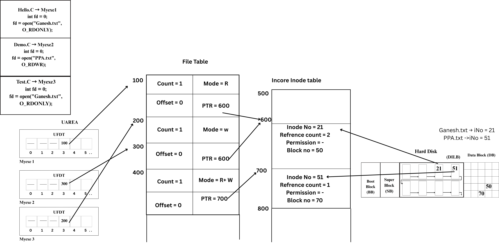

# 📂 Marvellous CVFS (Custom Virtual File System)


A **console-based Virtual File System (VFS)** implemented in C++.  
It emulates a simplified operating system file system where all files & directories are stored in **primary memory (RAM)** instead of disk.  

---

## 📑 Table of Contents
- [📂 Marvellous CVFS](#-marvellous-cvfs-custom-virtual-file-system)
- [📌 Project Architecture](#-project-architecture)
- [⚙️ Features](#️-features)
- [📖 Command Manual](#-command-manual)
- [🛠️ Core Functions](#️-core-functions)
- [🚨 Error Handling](#-error-handling)
- [▶️ How to Run](#️-how-to-run)


---

## 📌 Project Architecture

### Disk Layout (Figure 1)
- **Boot Block** – Stores startup information  
- **Super Block** – Tracks free & total inodes  
- **Disk Inode List Block (DILB)** – Holds inodes (file metadata)  
- **Data Blocks (DB)** – Stores actual file data  

  
*Figure 1: Disk Layout*

### File Handling Flow (Figure 2)
- Flow of file handling from **UAREA → File Table → Inode Table → DILB → Data Blocks**  

  
*Figure 2: File Handling Flow*

---

## ⚙️ Features
✔️ Create, read, write, close, and delete files  
✔️ Directory operations (mkdir, rmdir, cd, ls)  
✔️ Metadata retrieval (`stat`, `fstat`, `chmod`, `find`)  
✔️ File navigation using `lseek`  
✔️ Utility commands (`help`, `man`, `clear`, `exit`, `mkfs`)  
✔️ Console-based shell (`Marvellous CVFS >`)  

---

## 📖 Command Manual

| Command | Usage | Description |
|---------|-------|-------------|
| `help` | `help` | Displays available commands |
| `man` | `man <command>` | Shows manual for a command |
| `creat` | `creat <filename> <permission>` | Create a new file (1=Read, 2=Write, 3=Read+Write) |
| `open` | `open <filename> <mode>` | Open existing file in given mode |
| `close` | `close <fd>` | Close an opened file |
| `write` | `write <fd>` | Write data into a file |
| `read` | `read <fd> <size>` | Read `size` bytes from a file |
| `unlink` | `unlink <filename>` | Delete a file |
| `ls` | `ls` | List all files and directories |
| `stat` | `stat <filename>` | Show metadata of a file |
| `fstat` | `fstat <fd>` | Show metadata via file descriptor |
| `chmod` | `chmod <filename> <permission>` | Change permissions of file |
| `lseek` | `lseek <fd> <offset> <whence>` | Change read/write offset |
| `mkdir` | `mkdir <dirname>` | Create a directory |
| `rmdir` | `rmdir <dirname>` | Remove a directory |
| `cd` | `cd <dirname>` | Change current directory |
| `find` | `find <filename>` | Search a file |
| `clear` | `clear` | Clear console |
| `exit` | `exit` | Save FS and exit |

---

## 🛠️ Core Functions

Each function in the code has a structured header with:  
- **Description** – Purpose of function  
- **Input** – Parameters  
- **Output** – Return values  
- **Author** – Shreyas Prakash Thorat  

Examples:

- `CreateFile(char* name, int permission)` → Creates a new file  
- `UnlinkFile(char* name)` → Deletes a file  
- `ls_file()` → Lists all files  
- `stat_File(char* name)` → Displays file stats  
- `write_File(int fd, char* data, int size)` → Writes data  
- `read_File(int fd, char* data, int size)` → Reads data  

*(Full detailed list is included in source code headers.)*

---

## 🚨 Error Handling

| Code | Meaning |
|------|---------|
| `-1` | Invalid Parameter |
| `-2` | No Inodes Available |
| `-3` | File Already Exists |
| `-4` | File Does Not Exist |
| `-5` | Permission Denied |
| `-6` | Insufficient Space |
| `-7` | Insufficient Data |
| `0`  | Execution Successful |

---

## ▶️ How to Run

```bash
# Compile
g++ cvfs.cpp -o cvfs

# Run
./cvfs
